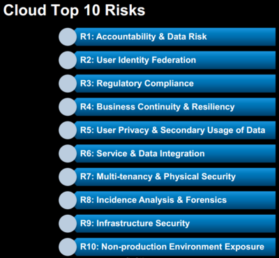

# Mobile Top 10 2016-M1-不適切なプラットフォームの利用

| 脅威エージェント |
| --- |
| アプリケーション依存 |
| このカテゴリはプラットフォーム機能やプラットフォームセキュリティコントロールの正しくない使い方を対象としています。モバイルオペレーティングシステムの一部である、Androidインテント、プラットフォームパーミッション、TouchIDの誤用、キーチェーン、その他のセキュリティコントロールを扱います。 |

| 攻撃手法 |
| --- |
| 悪用難易度 容易 |
| 攻撃手法は従来の OWASP Top Ten で利用できる同様の攻撃手法に準じています。 |

| セキュリティ上の弱点 |
| --- |
| 普及度 中, 検出難易度 普通 |
| この脆弱性を悪用するには、モバイルアプリで使用されるウェブサービスや API コールを公開する必要があります。公開されたサービスや API コールはサーバー内の OWASP Top Ten 脆弱性を引き起こす安全でないコーディング技法を使用して実装されます。モバイルインターフェースを介して、攻撃者は脆弱なエンドポイントに悪意のある入力や予期しない一連のイベントを注入することができます。したがって、攻撃者はサーバー上のオリジナルの OWASP Top Ten 脆弱性を認識します。 |

| 技術的影響 |
| --- |
| 影響度 深刻 |
| この脆弱性の技術的影響は攻撃者がモバイルデバイスを介して悪用している(OWASP Top Ten で定義されている)関連する脆弱性の技術的影響に準じています。 |
| 例えば、攻撃者はモバイルデバイスを介してクロスサイトスクリプティング(XSS)脆弱性を悪用する可能性があります。これは OWASP Top Ten A3 - XSS カテゴリに相当し、中程度の技術的影響があります。 |

| ビジネスへの影響 |
| --- |
| アプリケーション / ビジネス依存 |
| この脆弱性によるビジネスへの影響は攻撃者がモバイルデバイスを介して悪用している(OWASP Top Ten で定義されている)関連する脆弱性のビジネスへの影響に準じています。 |
| 例えば、攻撃者はモバイルデバイスを介してクロスサイトスクリプティング(XSS)脆弱性を悪用する可能性があります。これは OWASP Top Ten A3 - XSS カテゴリのビジネスへの影響に相当します。 |

| &#39;不適切なプラットフォームの利用&#39;の脆弱性があるか？ |
| --- |
| このカテゴリのリスクの特徴を定義すると、プラットフォーム (iOS, Android, Windows Phone など) が文書化されてよく理解されている機能や能力を提供することです。アプリはその機能を使用できないか間違って使用します。これは設計及び実装が厳密にはアプリ開発者の問題ではないため、他のモバイルトップテンリスクとは異なります。 |

モバイルアプリではさまざまな場面でこのリスクが発生します。

1. **公表されたガイドラインの違反。** すべてのプラットフォームにはセキュリティの開発ガイドラインがあります(参照, ((Android)), ((iOS)), ((Windows Phone)))。アプリが製造元推奨のベストプラクティスに反する場合、このリスクにさらされます。例えば、iOS キーチェーンの使い方や Android でエクスポートされるサービスをセキュアにする方法に関するガイドラインがあります。これらのガイドラインに従わないアプリではこのリスクが発生します。
1. **慣例や一般的な慣行の違反。** すべてのベストプラクティスが製造元のガイダンスにまとめられているわけではありません。場合によっては、モバイルアプリでよく見られるデファクトのベストプラクティスがあります。
1. **意図しない誤用。** アプリの中には正しいことをしようとしているものの、実際には一部を間違って実装しています。これは API コールで間違ったフラグを設定するなどの簡単なバグであり、保護の仕組みを誤解している可能性があります。

プラットフォームのパーミッションモデルの失敗はこのカテゴリに該当します。例えば、アプリがあまりにも多くのパーミッションや間違ったパーミッションを要求する場合は、ここに分類するのが最適です。

---

## &#39;不適切なプラットフォームの利用&#39;を防ぐには？

モバイルアプリケーションのサーバー側ではセキュアコーディングおよび構成のプラクティスを使用する必要があります。特定の脆弱性情報については、OWASP Web Top Ten や Cloud Top Ten プロジェクトを参照ください。

---

## 攻撃シナリオの例

いくつものプラットフォームがあり、それぞれ数百もしくは数千の API があるため、このセクションの例では可能なことを表面的に論じています。

**キーチェーンの代替としてのアプリローカルストレージ**
iOS キーチェーンはアプリとシステムデータの両者のためのセキュアなストレージ機能です。iOS では、アプリはセキュリティ上重要である小さなデータ(セッションキー、パスワード、デバイス登録データなど)を格納するためにキーチェーンを使用すべきです。よくある間違いはそのようなアイテムをアプリのローカルストレージに格納することです。アプリのローカルストレージに格納されたデータは(ユーザーのコンピュータなどの)暗号化されていない iTunes バックアップで利用できます。一部のアプリでは、その開示は不適切です。

以下では、M1 に応じるために軽減する必要がある多くのリスクや脆弱性があることがわかります。

[Cloud Top 10 Risks](https://www.owasp.org/index.php/Category:OWASP_Cloud_%E2%80%90_10_Project)

[OWASP Top 10 - 2013](https://www.owasp.org/index.php/Category:OWASP_Top_Ten_Project)

### 最悪の攻撃者

以下は OWASP がモバイルアプリケーションで最もよく見るタイプの脆弱性のリストです。

- 不十分なウェブサービスの強化
  - ロジックの欠陥
    - [Testing for business logic flaws](https://www.owasp.org/index.php/Testing_for_business_logic_%28OWASP-BL-001%29)
    - [Business Logic Security Cheat Sheet](https://www.owasp.org/index.php/Business_Logic_Security_Cheat_Sheet) [(和訳)](https://jpcertcc.github.io/OWASPdocuments/CheatSheets/BusinessLogicSecurity.html)
  - 認証の不備
    - [OWASP Top Ten Broken Authentication Section](https://www.owasp.org/index.php/Top_10_2013-A2-Broken_Authentication_and_Session_Management)
    - [Authentication Cheat Sheet](https://www.owasp.org/index.php/Authentication_Cheat_Sheet) [(和訳)](https://jpcertcc.github.io/OWASPdocuments/CheatSheets/Authentication.html)
    - [Developers Guide for Authentication](https://www.owasp.org/index.php/Guide_to_Authentication)
    - [Testing for Authentication](https://www.owasp.org/index.php/Testing_for_authentication)
  - セッション管理の不備や不在
  - セッションIDの固定化
  - GET メソッドを使用した機密データの転送
- 安全でないウェブサーバーの構成
  - デフォルトコンテンツ
  - 管理インターフェース
- ウェブサービスおよびモバイル対応のウェブサイトでのインジェクション (SQL, XSS, Command)
- 認証の欠陥
- セッション管理の欠陥
- アクセスコントロールの脆弱性
- ローカルおよびリモートファイルのインクルード

---

## 参考資料

**OWASP**

- [OWASP Top Ten](https://www.owasp.org/index.php/OWASP_Top_Ten)

**その他**

- [CWE](http://cwe.mitre.org/)
